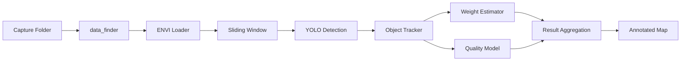

# LISA – Hyperspectral Vineyard Pipeline

LISA bundles the code that accompanies the grape quality monitoring paper. The repository contains the full processing pipeline, pre-trained models, and supporting artefacts used to generate spatial maps of grape bunch quality from hyperspectral captures.

## Highlights

- End-to-end processing pipeline with YOLO-based bunch detection, weight prediction, and quality estimation.
- Ready-to-use pretrained weights stored under `models/` for reproducible results.
- CLI for batch processing single folders or continuously watching for new captures.
- Lightweight Python package (`lisa`) with reusable helpers for custom tooling.
- Example outputs in `results/`.

## Quickstart

1. Install [Git LFS](https://git-lfs.com) (required for the large checkpoints) and initialise it inside the repository:
   ```bash
   git lfs install
   git lfs pull
   ```
   > Tip: if `models/configs.pkl` begins with the ASCII string `version https://git-lfs…` you are still seeing an LFS pointer. Re-run the commands above or copy the real checkpoints from your local archive before continuing.
2. Create and activate an environment (Python 3.11 works best with the pinned packages):
   ```bash
   python3.11 -m venv .venv
   source .venv/bin/activate  # Windows: .venv\Scripts\activate
   ```
3. Install dependencies:
   ```bash
   pip install -r requirements.txt
   ```
4. (Optional, recommended) Install the project in editable mode to expose the `lisa` console entry point:
   ```bash
   pip install -e .
   ```

## Sample Data

The hyperspectral captures are large (several GB per sweep), so the repository keeps the `data/` folder empty by default. Host the demo capture externally (e.g. Azure Blob, Hugging Face Hub, S3) and provide a direct download link.

1. Export a small representative capture folder as `sample_capture.tar.gz` (include the `capture/*.hdr` and `capture/*.raw` files).
2. A ready-to-use sample is hosted at [cloud.ilabt.imec.be](https://cloud.ilabt.imec.be/index.php/s/5z7pC8Dwt7LfHWL) with the direct download link `https://cloud.ilabt.imec.be/index.php/s/5z7pC8Dwt7LfHWL/download`.
3. Download and extract via the helper script:
   ```bash
   bash scripts/download_sample_data.sh
   ```
   The script fetches the archive, extracts it into `data/sample_capture`, and cleans up the tarball. Update the URL once the hosting location is final.

## Usage

Process an individual capture folder:
```bash
python main.py process-folder data/my_capture --update-log
```

Watch the default `data/` directory and process any new folders once:
```bash
python main.py watch --run-once
```

Additional options:
- `--legacy-rgb` switches to the historic visualization used in earlier experiments.
- `--confidence 0.25` customises the YOLO detection confidence.
- `--show-fig` opens the generated annotated map after processing.
- `--watch-path /custom/path` lets the watcher follow an alternate directory tree.
- `--skip-map` is handy for headless runs when you only need the JSON output.

See `python main.py --help` (or `lisa --help` after editable installation) for the full CLI reference.

## Repository Layout

- `main.py` – lightweight entry point delegating to the new CLI.
- `src/lisa/` – reusable library code (config, asset loading, runtime helpers, CLI).
- `src/lisa/inference.py` – modernised inference utilities (object tracking, sliding window, loaders).
- `src/lisa/visualization.py` – helpers for rendering annotated overview maps.
- `src/lisa/legacy_models.py` – transformer and autoencoder definitions retained for compatibility with the original experiments.
- `src/pipeline.py` and `src/utilities.py` – compatibility shims that keep legacy notebooks working (new code should import from `src/lisa`).
- `models/` – pretrained weights and cached artefacts referenced by the pipeline.
- `results/` – sample annotated maps generated by the pipeline (e.g. `results/20250926_FX10_sweep_voorkant_2025-09-26_13-32-49.png`).
- `relevantInformation/` – paper resources that may migrate to an external archive later.
- `demoTest.ipynb` – exploratory notebook using the legacy APIs.
- `scripts/` – helper utilities such as `scripts/download_sample_data.sh`.

## Demo Scripts

- `run_demo.sh`
- `run_demo.bat`

Both scripts activate `venv/` when present and execute `python main.py watch --run-once`. Populate `data/` with a capture folder to try the pipeline locally.

## Architecture Overview



## Example Output


## Paper

The manuscript is stored at `_Ciem__Hyperspectral_grape_monitoring___IoT_journal.Final.pdf`. Supporting LaTeX sources live under `relevantInformation/`.

## Notes

- Model checkpoints (`.pth`, `.pkl`) are sizeable; keep them in Git LFS if the repository footprint grows.
- CUDA is supported for faster inference, but the pipeline runs on CPU as well.
- When the `relevantInformation/` folder moves elsewhere, update the README links accordingly.
- If you hit `_pickle.UnpicklingError: invalid load key, 'v'`, double-check that Git LFS downloaded the real artifacts and that you are not pointing at pointer stubs.
- `src/pipeline.py` and `src/utilities.py` remain for backwards compatibility; new applications should rely on the `src/lisa` package modules instead.

## Citation

If you find this work useful, please cite the accompanying article:

```
@ARTICLE{11192515,
   author    = {Cornelissen, Ciem and Coninck, Sander De and Willekens, Axel and Leroux, Sam and Simoens, Pieter},
   journal   = {IEEE Internet of Things Journal},
   title     = {In-Field Mapping of Grape Yield and Quality with Illumination-Invariant Deep Learning},
   year      = {2025},
   volume    = {},
   number    = {},
   pages     = {1-1},
   doi       = {10.1109/JIOT.2025.3617805},
   keywords  = {Precision Viticulture; Agricultural Robotics; Hyperspectral Imaging; Illumination Invariance; Domain Generalization; Deep Learning; Brix Prediction; Sustainability}
}
```

Paper: <https://ieeexplore.ieee.org/document/11192515>

Preprint: <https://arxiv.org/abs/2510.04864>

## Contact

- Website: <https://ciemcornelissen.github.io>
- Email: [ciem.cornelissen@ugent.be](mailto:ciem.cornelissen@ugent.be)

Feel free to reach out for collaboration requests, questions about the dataset, or to share improvements to the pipeline.

Happy experimenting!
